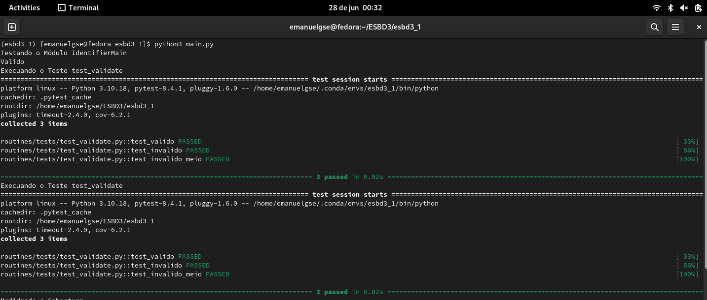
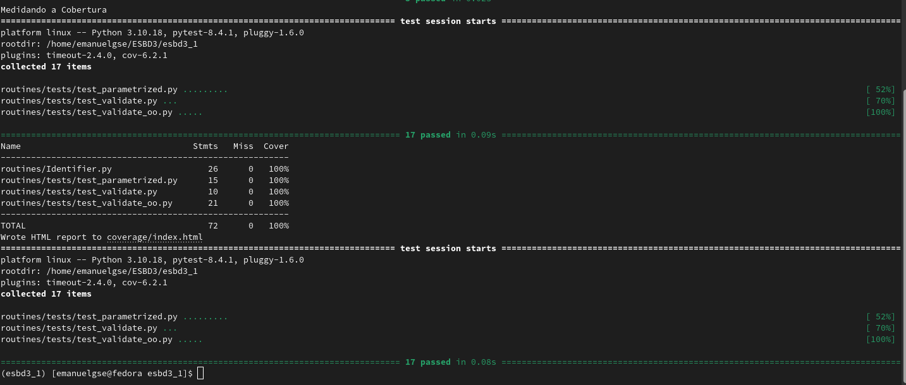
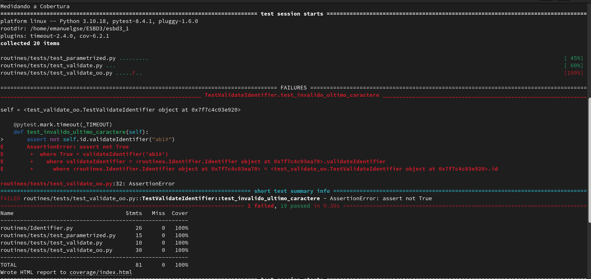
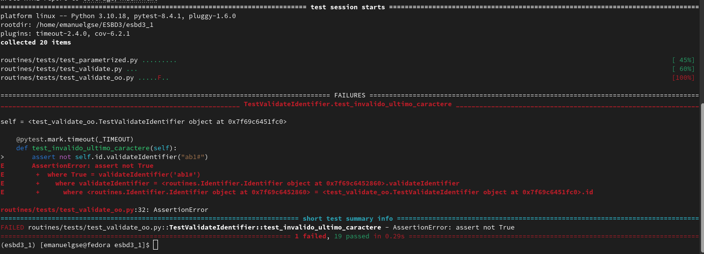

### Análise inicial:

Inicialmente o código foi refatorado pois havia problemas de relative imports e não vi necessidade em gerar um pacote "identifiermain" e associa-lo ao ambiente virtual apenas para rodar o coverage.

## Prints das Execuções iniciais:





## Análise Final:

Embora obtivemos 100% de cobertura de comandos, não significa ausência de erros ou que foi explorado todas as combinações possiveis que geram algum erro. No modulo Identifier.py na linha 32, i.e.,

```python 

class Identifier(object):
...
    def validateIdentifier(self, s):
        ...
        while (i < (len(s) - 1)): 
            ...
...

```

observamos uma condição que nunca vai verificar o útilmo caractere da string e nenhum dos testes disponibilizados cobrem esse caso de testar um caracter invalido na ultima posição o que expoem um caso do tipo caixa-branca (fluxo de controle), Como nosso caso de uso restringe o tamanho da string ao intervalo [1,5] é interessante testarmos caracteres inválidos na primeira posição, no meio, e na ultima posição compondo assim nosso teste do tipo caixa preta (valor limite), por exemplo, para uma string S com len (S) = 0 ou len(S) = 6 foge da fronteira do intervalo possuindo identificador inválido. 

Adicionando em tests/tes_validate_oo os novos testes:

```python

class TestValidateIdentifier:
...
    @pytest.mark.timeout(_TIMEOUT)
    def test_invalido_ultimo_caractere(self):
        assert not self.id.validateIdentifier("ab1#")

    @pytest.mark.timeout(_TIMEOUT)
    def test_valido_comprimento_um(self):
        assert self.id.validateIdentifier("A")
        
    @pytest.mark.timeout(_TIMEOUT)
    def test_valido_comprimento_cinco(self):
        assert self.id.validateIdentifier("abcde")

```
o teste test_invalido_ultimo_caractere testa o limite posicional (um erro no final da string) e é o teste que prova a existência do bug no código original. test_valido_comprimento_um garante que uma string com 1 caractere seja valida (limite inferior), e test_valido_comprimento_cinco garante que uma string com 5 caracteres seja valida (limite superior).

nas imagens abaixo podemos ver o teste test_invalido_ultimo_caractere falhando devido ao byg no código  que retornou True. Para remover o bug basta tirarmos o -1 do while que quando chegar em i=3 retorna o caractere # e portanto self.valid_f('#') vai retornar False como deveria.



